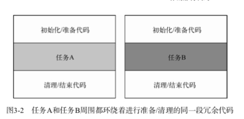
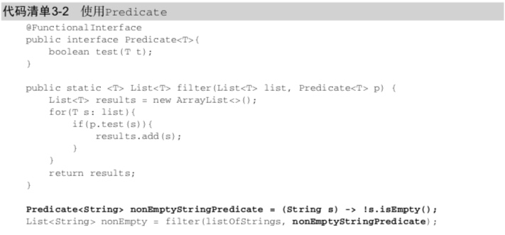
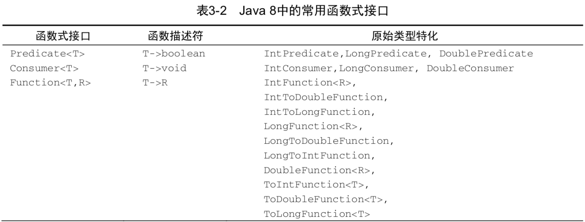
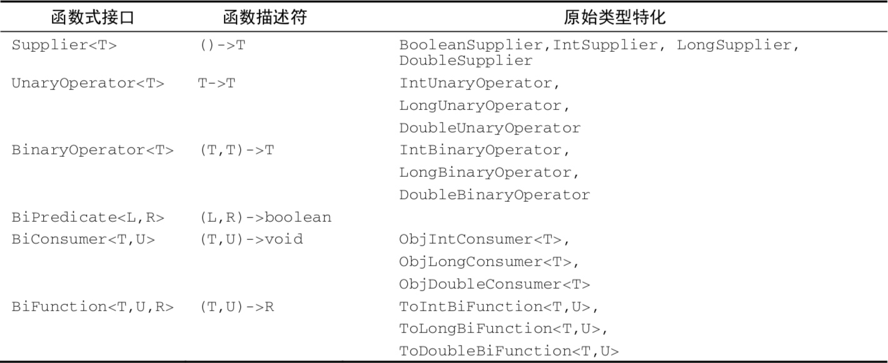
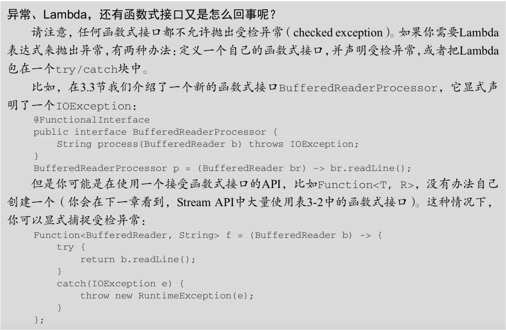
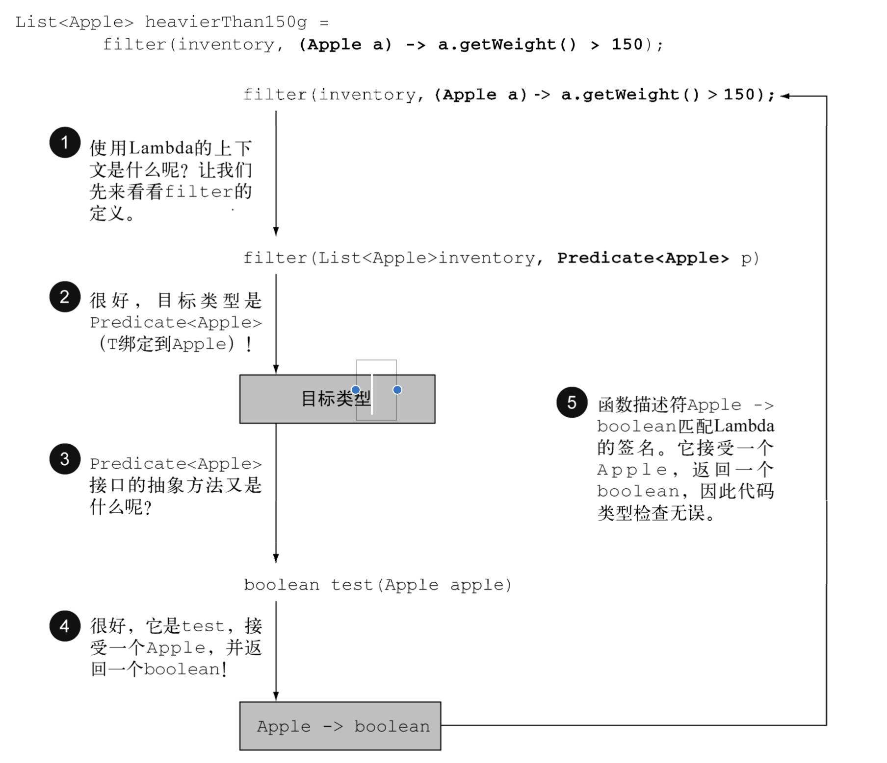
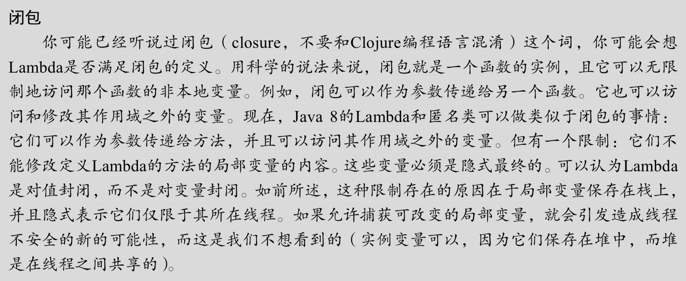
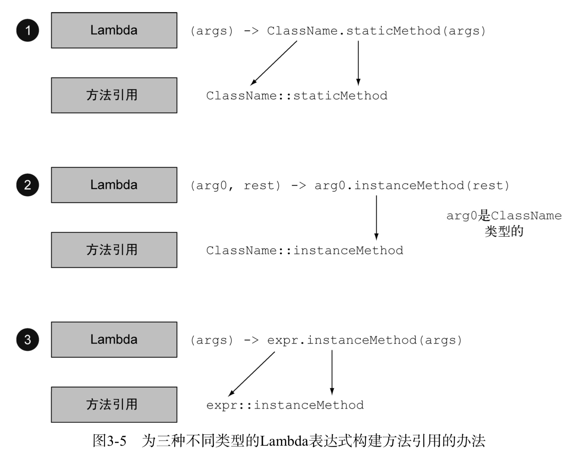
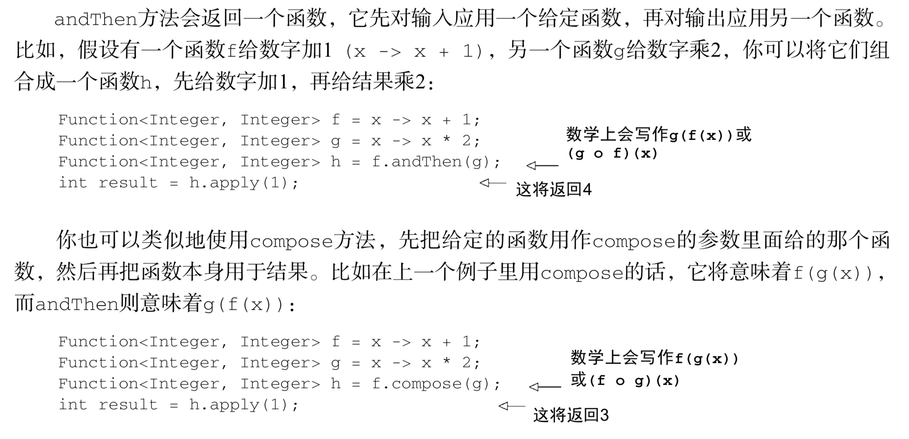

# Java8 实战

[TOC]

## 第一部分 基础知识

### 第一章 引子


1. 流处理
Stream API:使得能够在更高的抽象层次上写Java程序.此外,可以透明的把输入不相关的部分进行并行,不需要去手动写Thread
2. 行为参数化
增加了通过API传递代码的能力
3. 并行与共享的可变数据
透明的并发编程

允许将方法作为值,成为一等公民

#### 行为参数化

通过一个例子理解行为参数化:

```
public class example1 {

    /*
    * 旧的方式,过滤出绿色苹果
    * */
    public static List<Apple> filterGreenApples(List<Apple> apples) {
        List<Apple> result = new ArrayList<>();
        for (Apple apple:apples) {
            if ("green".equals(apple.getColor())) {
                result.add(apple);
            }
        }
        return result;
    }


    /*
     * 旧的方式,过滤出重量超过给定值的苹果
     * */
    public static List<Apple> filterHeavyApples(List<Apple> apples) {
        List<Apple> result = new ArrayList<>();
        for (Apple apple:apples) {
            if (apple.getWeight() > 150) {
                result.add(apple);
            }
        }
        return result;
    }

    /*
     * Java8行为参数化
     * */
    interface Predicate<T> {
        boolean test(T t);
    }

    public static boolean isGreenApple(Apple apple) {
        return "green".equals(apple.getColor());
    }

    public static boolean isHeavyApple(Apple apple) {
        return apple.getWeight()>150;
    }

    static List<Apple> filterApples(List<Apple> apples,Predicate<Apple> p) {
        List<Apple> result = new ArrayList<>();
        for (Apple apple:apples) {
            if (p.test(apple)) {
                result.add(apple);
            }
        }
        return result;
    }

    /*调用实例*/
    public static void main(String[] args) {
        filterApples(apples, example1::isGreenApple);
        filterApples(apples, example1::isHeavyApple);

    }
     

}
```

> 谓词:接收一个参数值,并返回true或false.Java8也会允许写Function<Apple,Boolean>,但用Predicate<Apple>是更标准的方式,效率也会更高一些,避免了把boolean封装在Boolean里面.
> 

上面的例子可以写的更为简洁,利用lambda表达式甚至可以不用写isGreenApple和isHeavyApple等方法定义.

```
filterApple(apples,(Apple a) -> "green".equals(a.getColor()));
filterApple(apples,(Apple a) -> a.getWeight() > 150);
```
更简洁的方法是直接调用库方法filter:

```
filter(apples,(Apple a) -> a.getWeight() > 150);
```

#### Stream
主要解决两个问题:
1. 对于集合的外部迭代要写很多套路代码,不够简洁.
2. 多线程的集合操作

***Collections主要用于存储和访问数据,而Stream主要用于描述对数据的计算***

Stream允许并提倡并行处理一个Stream中的元素,筛选一个Collection的最快方法常常是将其转换为Stream,进行并行处理,然后再转换为List.

#### 默认方法
主要为了支持现有程序的改进.比如Java8需要给集合添加Stream API,如果想要对原有接口改动,那么将会出现大量地实现类需要修改代码以实现新的接口方法,这种改动将会是巨大的,并且会改变用户的使用方式.
***如何改变已发布的接口而不破坏已有的实现?***
Java8的解决方案就是默认方法,接口可以包含实现类没有提供实现的方法签名,缺失的方法主体随接口提供,而不是由实现类提供

#### 来自函数式编程的良好思想
1. 将方法和lambda作为一等公民
2. 在没有可变共享状态时的安全并发
3. 通过描述性数据类型避免null(Optional)
4. 模式匹配

### 第二章 通过行为参数化传递代码
行为参数化:让方法接受多种行为作为参数,并在内部使用,来完成不同的行为.

行为参数化的好处在于可以把迭代要筛选的集合的逻辑与对集合中每个元素应用的行为区分开来.这样可以重复使用同一个方法,给他不同的行为来达到不同的目的.

一个更抽象的例子:

```
public class Example2 {


    interface Predicate<T> {
        boolean test(T t);
    }


    public static <T> List<T> printList(List<T> list, Predicate<T> p) {
        List<T> result = new ArrayList<>();

        for (T t : list) {
            if (p.test(t)) {
                result.add(t);
            }
        }
        return result;
    }


}
```

> 行为参数化是一个很有用的模式,能够轻松适应不断变化的需求,这种模式可以把一个行为封装起来,并 通过传递和使用创建的行为将方法的行为参数化.这种做法类似于策略模式.
> 

### 第三章 lambda表达式
参数列表  +  ->  +  函数主体
lambda表达式中没有return,隐式包含return

```
Comparator<Apple> comparator = new Comparator<Apple>() {
            @Override
            public int compare(Apple o1, Apple o2) {
                return o1.getWeight()-o2.getWeight();
            }
        };

Comparator<Apple> lambdaComparator = (Apple a1,Apple a2) -> a1.getWeight().compareTo(a2.getWeight());
```

**何时可以使用Lambda:**
函数式接口(只定义一个抽象方法的接口)
举例:Runnable,Comparator,Callable等

**Lambda接口的作用**:
允许直接以内联的形式为函数式接口的抽象方法提供实现,并把整个表达式作为函数式接口的实例(准确的说是函数式接口一个具体实现的实例).用匿名内部类也可以完成同样的事情,只不过比较笨拙:需要提供一个实现,然后再直接内联将它实例化.

函数描述符:
函数式接口的抽象方法的签名基本上就是Lambda表达式的签名,这种抽象方法叫做函数描述符.(只要返回值类型和参数列表一样就行)

Lambda表达式可以被赋给一个变量,或传递给一个接受函数式接口作为参数的方法.

@FunctionalInterface
用于表示该接口会设计成一个函数式接口.如果用该注解定义了一个接口,而他却不是函数式接口,编译器会提示报错.该注解不是必须的,但是像@Override一样,使用它是比较好的做法.

一个例子:环绕执行模式:

原来的写法:

```
public static String processFile() throws IOException {
        try (BufferedReader br = new BufferedReader(new FileReader("data.txt"))){
            return br.readLine();
        }
    }
```
这样写的问题在于,如果我们对文档的操作改变,不是只读一行,需要新增一个方法

行为参数化:

```
@FunctionalInterface
interface BufferedReaderProcessor {
        String process(BufferedReader b) throws IOException;
}
public static String processFile(BufferedReaderProcessor p) throws IOException {
        try (BufferedReader br = new BufferedReader(new FileReader("data.txt"))){
            return p.process(br);
    }
}

String result = processFile((BufferedReader br) -> br.readLine());
```
步骤:
1. 定义一个函数式接口
2. 定义一个接收函数式接口为参数的方法
3. 将处理逻辑作为lambda,构成一个函数式接口的实例传递给方法.

现在我们可以利用函数式接口来传递lambda,但是还得定义自己的接口,后面再看Java8中加入的新接口,可以通过重用它来传递多个不同的lambda

Java8在java.util.function包中引入了几个新的函数式接口.

#### Predicate
Predicate<T>接口定义了一个名叫test的抽象方法,它接受泛型T对象,并返回一个boolean.可以直接使用它作为函数的参数.
还有一些高级的用法:and,or等


#### Consumer
Consumer<T>定义了一个名叫accept的抽象方法,它接受泛型T的对象,返回void.

```
public static <T> void forEach(List<T> list, Consumer<T> c) {
        for (T t : list) {
            c.accept(t);
        }
    }

public static void main(String[] args) {
        forEach(Arrays.asList(1, 2, 3, 4, 5), (Integer i) -> System.out.println(i));
}

```

#### Function
Function<T,R>接口定义了一个apply方法,接受一个T对象,返回一个R对象.如果需要定义一个lambda,将输入对象的信息映射到输出,就可以使用这个接口.

```
public static <T, R> List<R> map(List<T> list, Function<T, R> f) {
        List<R> result = new ArrayList<>();
        for (T t : list) {
            result.add(f.apply(t));
        }
        return result;
}
        
List<Integer> list = map(Arrays.asList("asdas","sdadas","as"), (String s) -> s.length());
```





#### 类型检查
Lambda的类型时从使用Lambda的上下文推断出来的.

注意:如果lambda表达式抛出一个异常,那么抽象方法所声明的throws语句也必须与之匹配

> 特殊的void兼容规则:
> 如果lambda的主体是一个语句表达式,它就和一个返回void的函数描述符兼容.例如下面两行都是合法的.(Predicate返回boolean而Consumer返回void)

```
Predicate<String> p = s -> list.add(s);
Consumer<String> b = s -> list.add(s);
```

#### 类型推断
编译器会自动推断参数的类型,可以写的更加简洁

```
Comparator<Apple> c = (Apple a1, Apple a2) -> a1.getWeight().compareTo(a2.getWeight());
Comparator<Apple> c = (a1, a2) -> a1.getWeight().compareTo(a2.getWeight());
```

#### 使用局部变量
Lambda表达式也允许使用自由变量(外层作用域定义的变量),就像匿名类一样,他们被称作捕获Lambda.
Lambda可以没有限制地捕获实例变量和静态变量,但局部变量必须显式声明为final.

为什么要有这样的限制:
1. 实例变量和局部变量背后的实现有关键的不同.实例变量存储在堆中,而局部变量则保存在栈上.如果Lambda可以访问局部变量,而且Lambda是在一个线程中使用的,则使用Lamnda的线程,可能会在分配该变量的线程将这个变量收回之后,去访问该变量.因此,Java在访问自由局部变量时,实际上是在访问它的副本,而不是访问原始变量.如果局部变量仅仅赋值一次那就没有区别了.
2. 这一限制不鼓励你使用改变外部变量的典型命令式编程模式



方法引用:可以重复使用现有的方法定义,并像lambda一样传递它们,可读性更好

```
    filterApples(apples, Example1::isGreenApple);
```


```
/*越来越简洁的写法,对苹果排序*/
public class Example5 {

    public static void main(String[] args) {

        List<Apple> apples = Arrays.asList(new Apple(), new Apple());

        /*传统写法*/
        class AppleComparator implements Comparator<Apple> {
            @Override
            public int compare(Apple o1, Apple o2) {
                return o1.getWeight().compareTo(o2.getWeight());
            }
        }
        apples.sort(new AppleComparator());

        /*匿名内部类*/
        apples.sort(new Comparator<Apple>() {
            @Override
            public int compare(Apple o1, Apple o2) {
                return o1.getWeight().compareTo(o2.getWeight());
            }
        });

        /*Lambda表达式*/
        apples.sort((Apple a1, Apple a2) -> a1.getWeight().compareTo(a2.getWeight()));

        /*类型推断*/
        apples.sort((a1, a2) -> a1.getWeight().compareTo(a2.getWeight()));

        /*利用Comparing函数*/
        apples.sort(Comparator.comparing((a) -> a.getWeight()));

        /*方法引用*/
        apples.sort(Comparator.comparing(Apple::getWeight));

    }

}
```

#### 复合lambda表达式

##### 比较器复合
逆序:

```
        apples.sort(Comparator.comparing(Apple::getWeight).reversed());
```
比较器链:

```
        apples.sort(Comparator.comparing(Apple::getWeight).reversed().thenComparing(Apple::getColor));
```

#### 谓词复合
复合的顺序从左往右优先级
a.or(b).and(c):      (a || b) && c

```
        Predicate<Apple> redApple = a -> a.getColor().equals("red");

        Predicate<Apple> notRed = redApple.negate();
        
        Predicate<Apple> redAndHeavy = redApple.and(a -> a.getWeight() > 150);
```

#### 函数复合




## 第二部分 函数式数据处理

## 第三部分 高效Java8编程

## 第四部分 超越Java8


